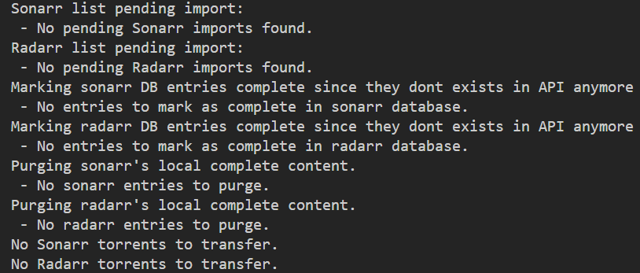

# Proxmox rsync Seedbox
This project is aimed to solve `rsync` cloning entire remote seedbox content to local for Radarr/Sonarr to import. (A major waste of disk space). 

This script will look at local Radarr/Sonarr's queue and grab matching file/directory from seedbox to local drive so Radarr/Sonarr can import them. Then the file/directory will be deleted to save space. Such file/directory name will mark as synced in a `sqlite3` database to keep track and never `rsync` the same file/directory again.

**This script will only grab (only work with) what is requested from your local Sonarr/Radarr instance.**

**This script is intended to run as a scheduled job (crontab/systemctl) to always maintain up to date file with seedbox content**

# Screenshot


# Features
- **Selective Sync**: Only transfers files that are pending import in local Radarr/Sonarr instance.
- **Seedbox Filtering**: Ensures files exist on the remote seedbox before attempting transfer.
- **Database Tracking**: Uses SQLite to track import attempts, retries, and completion status.
- **Automatic Cleanup**: Deletes files locally after successful import and marks them as purged in the database.
- **Retry Logic**: Retries failed imports up to 3 times before requiring manual intervention.
- **API Integration**: Fetches queue data from Radarr/Sonarr via their APIs.
- **SSH & Rsync**: Uses SSH for remote file listing and rsync for file transfer.
- **Environment Configuration**: All credentials and paths are managed via `.env`

# Setup
## 1. Configure Environment Variables
Create a `.env` file from `.env.example` in the project root. Replace all keys with your own Arr credentials. Debugging messages are off by default

## 2. Create virtual environment
```bash
python3 -m venv .venv
```

## 3. Activate virtual environment
```bash
source .venv/bin/activate
```
Windows user
```ps1
.venv/bin/activate.ps1
```

## 4. Install pip dependencies
```bash
pip install -r requirements.txt
```

## 5. Run application
```bash
python main.py
```

# How It Works
1. Gets the list of torrents pending import from local Radarr/Sonarr API
2. Checks which of these files exist on the seedbox via SSH. (Doesnt make sense to transfer file that doesnt exist on Seedbox)
3. Determines which files are new (INSERT to db) or need to be retried (UPDATE the db) (up to 3 times).
4. Transfers eligible files from seedbox to the local Radarr/Sonarr import directory.
## 2nd time it runs
1. Marks entries exists in DB but not in the Radarr/Sonarr API as completed.
    - Since a torrent import is not in API any more, it must mean import is complete or user cancelled the import task in Activity tab
2. Deletes local files that have been successfully imported and marks them as purged in DB.

# Troubleshooting
## RADAR_*** or SONAR_*** is not defined.
Please ensure your .env is filled with your own credentials from Sonarr/Radarr client
## Cannot make a connection to seedbox
Check SSH connectivity to the seedbox and make sure it is using key authentication
## Rsync is not installed
Please check if rsync is installed on **both end** of the system. Your local machine should have it, the seedbox should also have it.

# TODO
- Unit Test
